# Test execution report

A record of one complete run of every suite in this repository, against one application instance, on
one machine, with the evidence it produced.

| | |
|---|---|
| **Run date** | 2026-09-11 |
| **Commit under test** | `8d5edff` (`main`) |
| **Application version** | `billing-app` 1.0.0, Spring Boot 3.5.16 |
| **Executed by** | Abdeljalil Sennaoui, locally |
| **Result** | **165 tests executed, 165 passed, 0 failed, 0 skipped** |

Everything below was produced by the run described in [How the run was performed](#how-the-run-was-performed).
Nothing in this document is an expected value copied from a specification: the counts come from the
Maven and Cypress output, the coverage figures from the JaCoCo XML, and the screenshots from the
application itself while the suites were running against it.

---

## 1. Summary

| Suite | Tests | Passed | Failed | Duration | Runner |
|---|---:|---:|---:|---:|---|
| Domain unit | 27 | 27 | 0 | 0.3 s | JUnit 5 |
| Application integration (API + web layer) | 39 | 39 | 0 | 20.8 s | JUnit 5 + MockMvc |
| API automation (incl. 7 SOAP) | 52 | 52 | 0 | 52.6 s | TestNG + REST Assured |
| UI automation | 18 | 18 | 0 | 4 min 51 s | TestNG + Selenium 4 |
| BDD scenarios (14 API + 6 UI) | 20 | 20 | 0 | 2 min 04 s | Cucumber 7 + TestNG |
| Smoke | 7 | 7 | 0 | 2 s | Cypress 15 |
| Reset endpoint (`test-support` group) | 2 | 2 | 0 | 17.6 s | TestNG + REST Assured |
| **Total** | **165** | **165** | **0** | **≈ 9 min** | |

The BDD run reports 20 scenarios over **102 steps** (55 API + 47 UI), all passing.

Durations are wall-clock for the Maven invocation of each suite, measured on the machine described in
[section 3](#3-environment) while the application was running with the JaCoCo agent attached. The agent
adds measurement overhead, so these are not performance numbers — for those see
[section 7](#7-performance).

### Why the UI suite takes four minutes for eighteen tests

Every UI test gets a fresh Chrome session, started and quit around the test method. Sixteen seconds per
test is almost entirely browser startup. Reusing one session across tests would cut the run to well
under a minute and would let cookies, scroll position and leftover form state from one test leak into
the next — which is the cheapest way to acquire failures that reproduce only in a particular order. The
time is bought deliberately.

---

## 2. Scope

**In scope, and exercised by this run:**

| Area | Levels that covered it |
|---|---|
| Payment rules: partial, settling, overpayment, zero, negative, over-precise, cancelled, non-active policy | unit, integration, API, UI, BDD, Cypress |
| Invoice state transitions (`UNPAID` → `PARTIALLY_PAID` → `PAID`, `OVERDUE`, `CANCELLED`) | unit, integration, API, UI, BDD |
| Balance arithmetic and rounding | unit, integration, API |
| Customer and policy creation, duplicate email conflict, validation | integration, API, BDD |
| Error semantics — 400 vs 404 vs 409 vs 422, and the `code` in each body | integration, API, BDD |
| Invoice console: listing, status filter, overdue flag, detail page, payment form, error and success banners, 404 page | UI, BDD, Cypress |
| Invoice status over SOAP, including the WSDL and the fault path | API (7 tests) |
| QA reset endpoint | API (`test-support` group, run alone) |

Requirement-by-requirement mapping, by test class and method name, is in
[`requirements-traceability-matrix.md`](requirements-traceability-matrix.md) — 23 requirements, each
automated at least once.

**Out of scope for this run**, and stated here rather than left to be discovered:

- **Security testing.** No authentication exists in the application to test, and no scanning was run.
- **Accessibility.** No axe or WCAG checks. The console is a server-rendered table; that is a reason
  the risk is lower, not a reason it was tested.
- **Cross-browser.** Chrome only, in both Selenium and Cypress.
- **Concurrency against a single invoice.** The load plan gives every thread its own invoice, so two
  simultaneous payments against *the same* invoice are untested. `Invoice` has no `@Version`, so this is
  a plausible real defect the suite would not catch — see [section 9](#9-known-limitations).
- **Asynchronous client-side state.** The console renders on the server, so nothing here demonstrates
  waiting on an SPA's hydration or XHR.
- **A real database.** In-memory H2 throughout; no Testcontainers, because Docker is not installed on
  this machine.

---

## 3. Environment

| | |
|---|---|
| Machine | MacBook, macOS 26.6.2, arm64 hardware |
| JDK | Temurin-compatible OpenJDK 21.0.11 (Homebrew, x86_64 build under Rosetta) |
| Maven | 3.9.16 |
| Browser | Google Chrome 152.0.7977.83, headless (`--headless=new`), 1440×900 viewport |
| Chromedriver | Resolved at runtime by Selenium Manager; nothing pinned or committed |
| Node | v22.11.0, Cypress 15.21.1 |
| Application | `billing-app.jar` on port 8080, in-memory H2, `--qa.test-support.enabled=true` |
| Coverage | JaCoCo 0.8.15 agent attached to the application process |

The JVM reports `os.arch=x86_64` because the JDK on this machine is an Intel build running under
Rosetta; the hardware is arm64. It is recorded here because a performance number read out of this
report is a number measured through an emulation layer.

---

## How the run was performed

Exactly these commands, in this order:

```bash
export JAVA_HOME=$(/usr/libexec/java_home -v 21)

# 1. Build, and run the application's own 66 unit and integration tests.
mvn -B clean install -DskipITs

# 2. Start the application with the JaCoCo agent attached.
JACOCO=true scripts/start-app.sh

# 3. The black-box suites, against that one instance.
mvn -B verify -pl qa-api-tests
mvn -B verify -pl qa-ui-tests
mvn -B verify -pl qa-bdd-tests
( cd cypress && npx cypress run )

# 4. The reset group last and alone: it wipes the database.
mvn -B verify -pl qa-api-tests -Dapi.groups=test-support

# 5. Evidence for this report, from the same instance.
mvn -q -pl qa-ui-tests exec:java -Dexec.args=console

# 6. Stop the application — the agent writes its data from a shutdown hook — then merge and render.
scripts/stop-app.sh
mvn -B -pl billing-app jacoco:merge@merge-all-coverage jacoco:report@full-coverage-report
mvn -q -pl qa-ui-tests exec:java -Dexec.args=reports
```

Steps 1–4 and 6 are what [`scripts/coverage.sh`](../scripts/coverage.sh) automates, with the Cypress
smoke added here. Step 5 and the last line of step 6 are
[`scripts/capture-screenshots.sh`](../scripts/capture-screenshots.sh).

**One application instance for the whole run.** That matters: it is the arrangement under which
shared-state coupling between suites shows up. A suite that passes only against a freshly started
application is a suite with a hidden dependency on data nobody else has touched.

---

## 5. Evidence

Screenshots are captured by
[`DocumentationScreenshots`](../qa-ui-tests/src/main/java/com/insurancebilling/qa/ui/docs/DocumentationScreenshots.java),
which drives the application through the **same page objects and the same locators as the UI suite**,
in the same headless Chrome at the same viewport. The images therefore show the application as the
tests see it, and they break when the page objects break rather than drifting quietly out of date.

The database is reset to the seeded baseline immediately before capture, so the listing shows the six
seeded invoices rather than the several hundred records a full suite run leaves behind. Anything the
capture then pays or cancels is created by the capture itself.

### 5.1 The invoice console

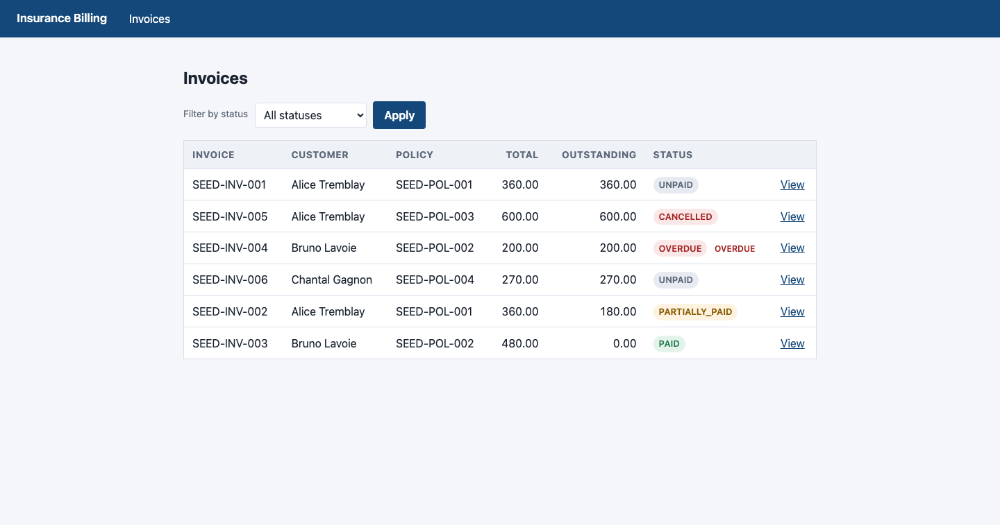

The seeded baseline: six invoices covering every state the domain can be in — unpaid, cancelled,
overdue, partially paid and paid — across three customers and four policies. Outstanding balances are
derived, not stored. This is the fixture every read-only scenario asserts against.

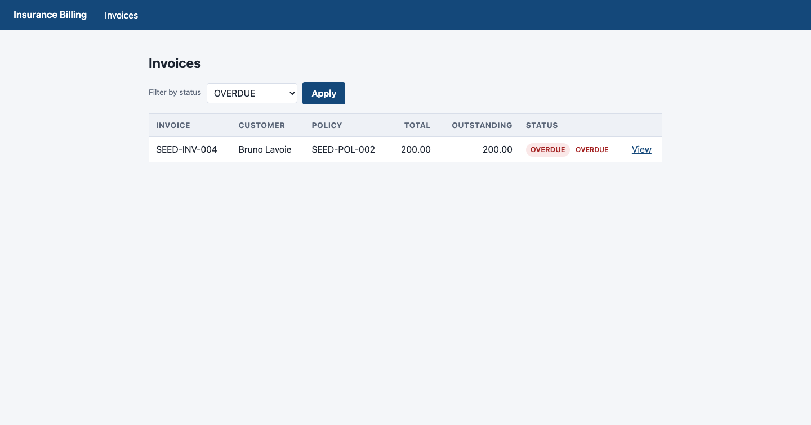

The status filter applied. Proves `GET /invoices?status=OVERDUE` narrows the table and that the overdue
flag is rendered next to the status badge. The UI suite waits for a *new document* here rather than for
an element to go stale — see DEF-011 in [`defect-reports.md`](defect-reports.md) for why that
distinction cost a day.

### 5.2 Invoice detail and payment history

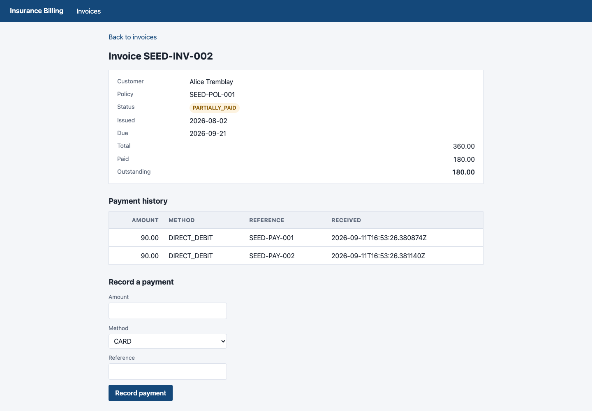

A seeded invoice with two instalments already received: total 360.00, paid 180.00, outstanding 180.00,
status `PARTIALLY_PAID`. Summary figures, payment history and the payment form are all on one page, and
every element the suite touches carries a `data-testid`.

### 5.3 A payment that is accepted

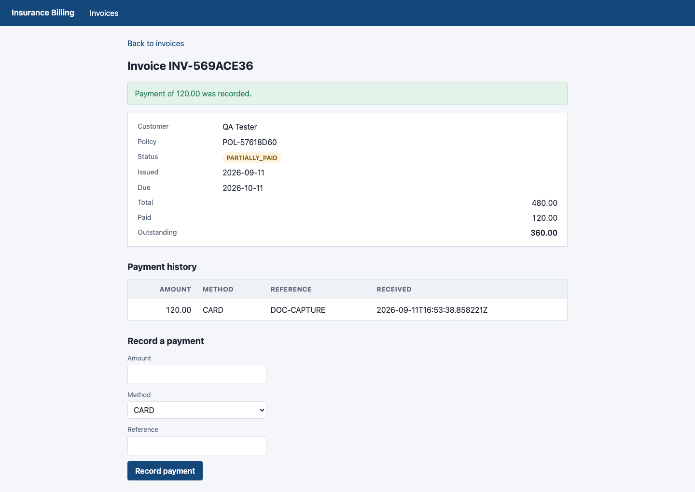

120.00 paid against a 480.00 invoice through the console form. The banner confirms the amount, the
summary moves to paid 120.00 / outstanding 360.00 / `PARTIALLY_PAID`, and the payment appears in the
history with its method and reference. What is on screen is a fresh `GET` of the invoice: the
controller redirects after a successful payment rather than rendering the `POST` response, so a browser
refresh cannot resubmit the payment. The form is empty again for the same reason — compare the refused
attempt below, which re-renders in place and keeps the rejected value in the field.

### 5.4 Payments that are refused, and *why* they are refused

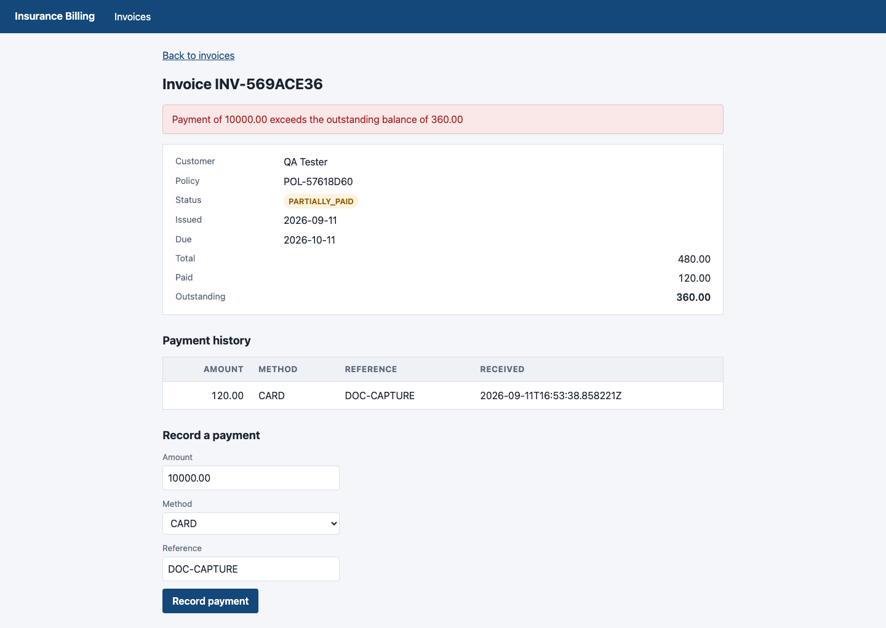

10,000.00 against a 360.00 balance. The API answers this with `422 EXCEEDS_OUTSTANDING_BALANCE` — a
billing rule refusing a well-formed request, not a validation error. The console shows the rule's own
message and the balance is untouched.

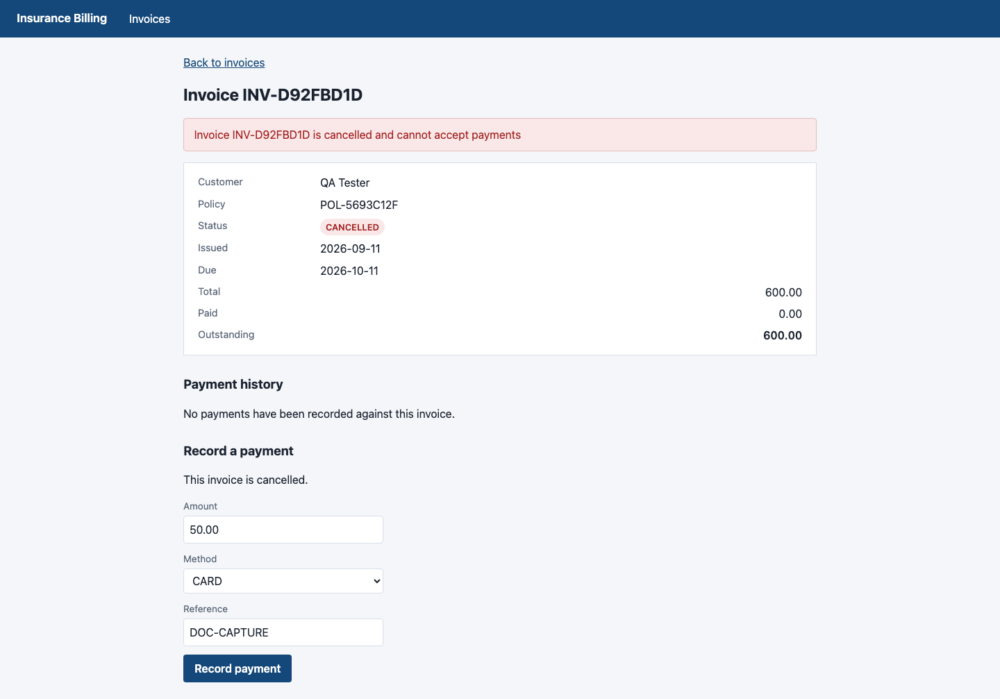

The same form against a cancelled invoice: refused for a different reason, with a different message,
and the page also states the invoice's state outright. Distinguishing *which* rule refused a payment is
the whole point of the status split documented in the [README](../README.md#error-semantics); a suite
that only asserted "an error appeared" would pass if the two rules were swapped.

### 5.5 Terminal and error states

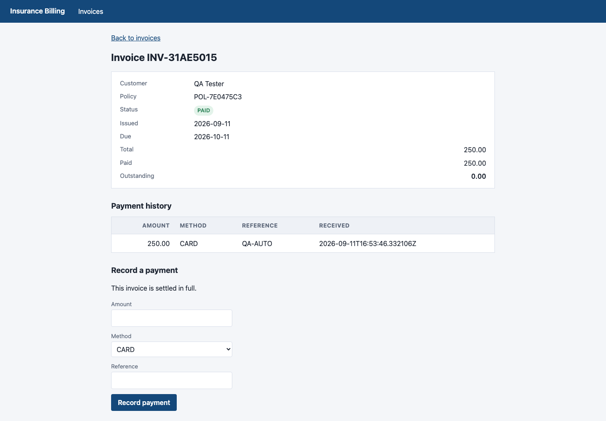

Settled in full: status `PAID`, outstanding 0.00, and the page says so explicitly rather than leaving an
empty form to be interpreted.

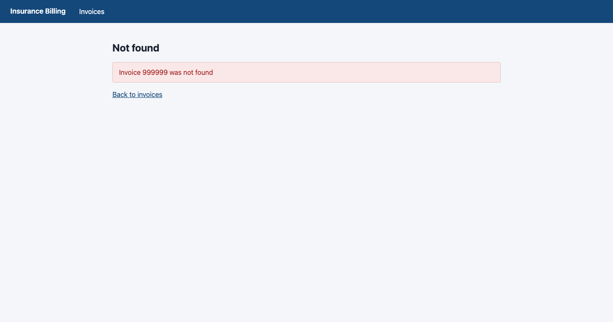

`/invoices/999999`. The console returns its own 404 page, not the JSON error body the REST API returns
for the same missing resource — the web controller declares a local `@ExceptionHandler` for exactly this
reason. Cypress asserts on it too.

---

## 6. Coverage

Measured during this run, from the merged JaCoCo execution data:

| Metric | Covered / total | In-process | Full-stack |
|---|---|---:|---:|
| Line | 484 / 489 | 91.0% | **99.0%** |
| Branch | 48 / 54 | 88.9% | **88.9%** |
| Instruction | 2049 / 2070 | 91.4% | **99.0%** |
| Method | 163 / 164 | 92.1% | **99.4%** |
| Class | 42 / 42 | 95.2% | **100%** |

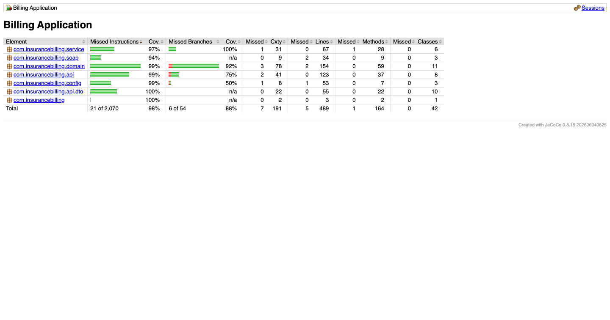

Both columns come from this run and reproduce the figures recorded in
[`coverage.md`](coverage.md) exactly. The gap between them is the point: the API, UI, BDD and Cypress
suites drive the application in a **separate JVM**, so an ordinary in-process coverage run sees nothing
they do. The SOAP package reads 44% in-process and 94% here.

Branch coverage is the honest number, it did not move, and all six missed branches are named
individually in [`coverage.md`](coverage.md). Each is defensive code whose failing side cannot be
reached through the application. There is deliberately **no coverage gate**.

### What this coverage figure does not say

99% of lines were executed. It does not follow that 99% of the behaviour is verified: a line is
"covered" if a test ran it, whether or not any assertion looked at what it did. The concurrency gap in
[section 9](#9-known-limitations) sits inside code that reports as fully covered.

---

## 7. Performance

**The load test was not re-run as part of this execution.** The dashboard below is the run of
2026-09-11 10:46 recorded in [`perf/README.md`](../perf/README.md), captured here for completeness.

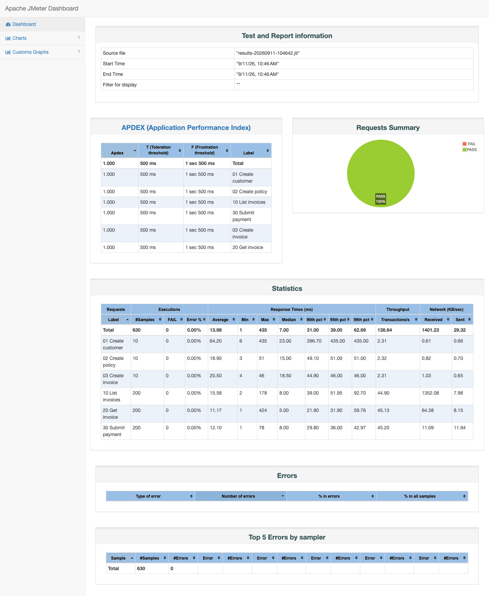

630 samples, 0% errors, 14.0 ms mean, 39 ms p95, 138.6 requests/s total. Read
[`perf/README.md`](../perf/README.md) before quoting any of that: the load generator and the
application shared one machine, the database was in-memory, and the run lasted five seconds. It shows
the paths work under concurrent load. It is not a capacity measurement.

---

## 8. BDD scenario reports

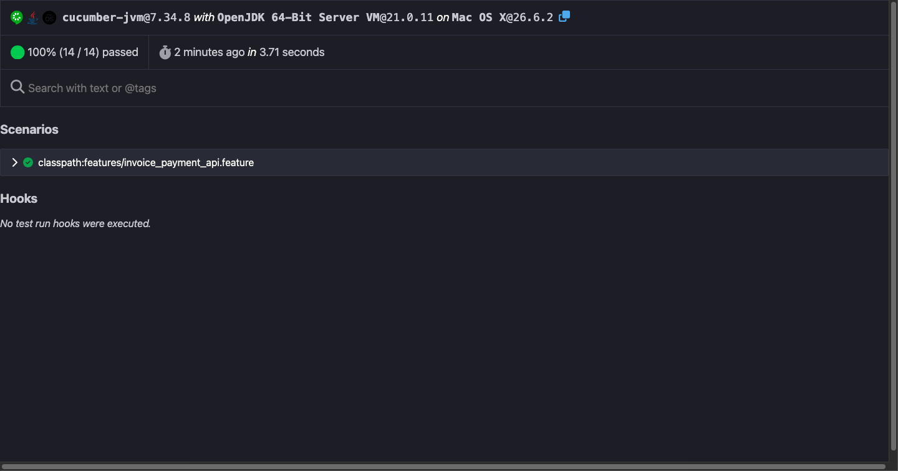

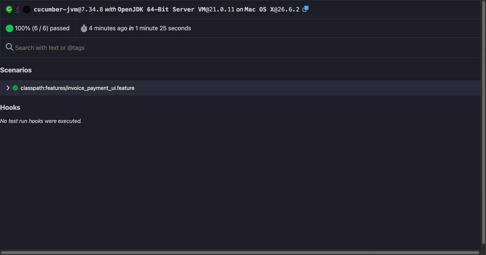

14 API scenarios over 55 steps and 6 browser scenarios over 47 steps, all passing. The two runners are
split by tag so a browser problem and a contract problem cannot arrive as the same red result.

---

## 9. Known limitations

Stated here because a report that only lists what passed is an advertisement.

1. **No optimistic locking on `Invoice`.** There is no `@Version`, and two concurrent payments against
   the same invoice are untested. Under load both could read the same balance and both be accepted,
   overpaying the invoice. This is the most likely real defect in the application, and it sits in code
   that reports as covered.
2. **`GET /api/invoices` has no pagination.** It returns every invoice. Harmless at six rows, linear at
   six hundred thousand.
3. **H2, not the database a billing platform would use.** Query latency and connection pooling — the
   costs that dominate in production — are absent from every figure here.
4. **Chrome only.** No Firefox, Safari or Edge run.
5. **Cypress overlaps the Selenium coverage.** Justified as triangulation across two independent
   toolchains; it is still duplication, and it is listed as such rather than counted twice.
6. **The Jenkins pipeline was not executed.** [`Jenkinsfile`](../Jenkinsfile) is written against this
   project's real layout and commands, but no Jenkins controller was available. GitHub Actions is the
   pipeline that actually gates merges.

---

## 10. Defects

Eleven defects were found and fixed while building the project, each documented with steps, root cause
and fixing commit in [`defect-reports.md`](defect-reports.md). **None is open**, and this run found no
new ones.

Three of the eleven were defects in the *test infrastructure* rather than the application — a test
group selector that was silently ignored, a start script that reported healthy for a server it had not
started, and Cucumber hooks that were never registered. Those are the dangerous ones: each produced a
green or healthy result while testing less than it claimed.

---

## 11. Reproducing this report

```bash
export JAVA_HOME=$(/usr/libexec/java_home -v 21)

./scripts/run-all.sh            # every suite, start to finish
./scripts/coverage.sh           # the same plus full-stack coverage
./scripts/capture-screenshots.sh  # regenerate every image in this document
```

The screenshots are committed under [`screenshots/`](screenshots) and are regenerated by the last
command, so a change to the console shows up as an image diff in the pull request that caused it.
